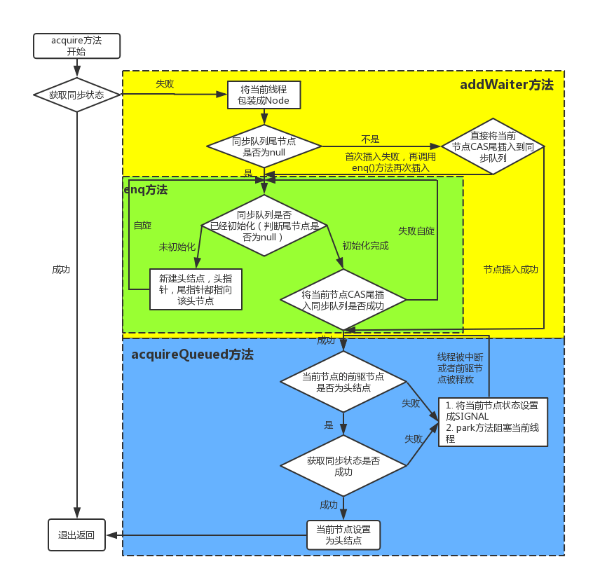

### AQS -- AbstractQueuedSynchronizer
> - 内部定义一个Node类来包装阻塞等待的线程；等待队列为双向链表结构，获得锁的过程是一个FIFO（先进先出）的过程。
- 相关资料
    - [博客园](https://www.cnblogs.com/waterystone/p/4920797.html)
    - [简书](https://www.jianshu.com/p/cc308d82cc71)

- acquire()方法（独占式锁）的获取过程
